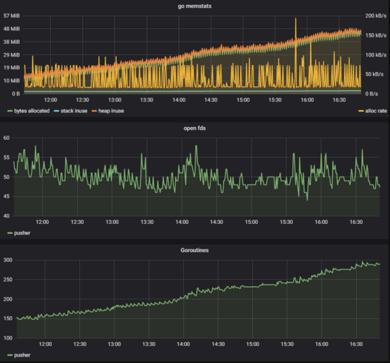

### Goroutine 泄露排查

我们在发布一个 go 应用时，默认都会启用两个 http handler: 一个是 pprof，方便线上动态追踪问题；另外一个是 prometheus 的 metrics，这样就可以通过 grafana 准实时的监控当前 runtime 信息，及时预警。就像下面这样：
***
```
    package router

    import (
    	"net/http"
    	_ "net/http/pprof"

    	"github.com/prometheus/client_golang/prometheus/promhttp"
    )

    func InitAdmin() {
    	adminRouter := http.DefaultServeMux
    	adminRouter.Handle("/metrics", promhttp.Handler())

        adminServer := &http.Server{
    		Addr:           ":8081",
    		Handler:        adminRouter,
    	}

    	go func() {
    		if err := adminServer.ListenAndServe(); err != nil {
    			println("ListenAndServe admin: ", err.Error())
    		}
    	}()
    }
```


最近我在优化一个 push 服务的时候，便观察到了一个 goroutine 泄露问题：
