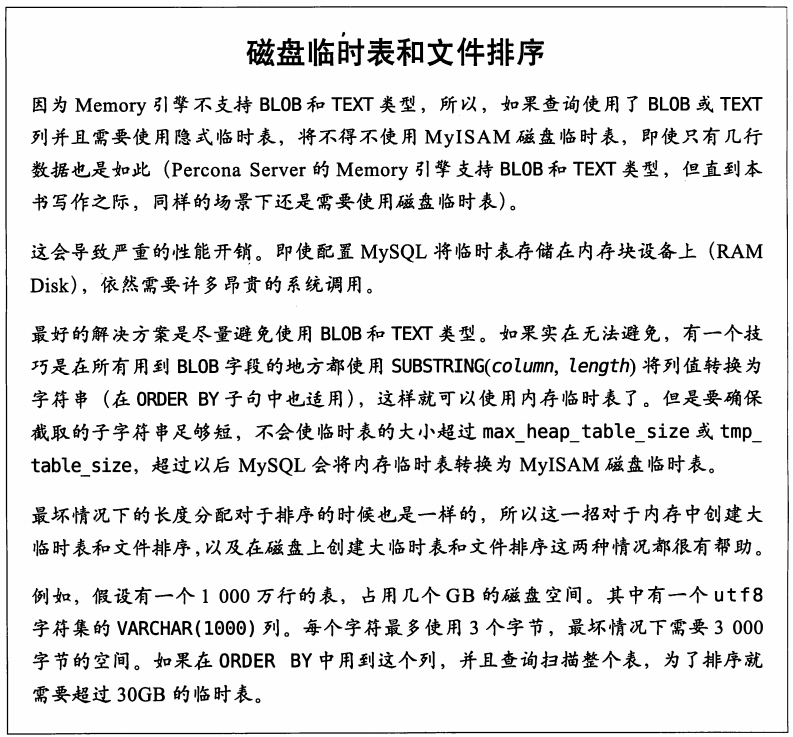

### Schema与数据类型优化
***

* 逻辑设计
* 物理设计
* 查询执行

* 三者之间的相互作用
***
4.1选择优化的数据类型
    * 更小的通常更好
    * 简单就好
    * 避免null
    
***
4.2 MYSQL schema 设计中的陷阱
    * 太多的列  
     MYSQL的存储引擎API工作时，需要再需服务器层和存储引擎层之间通过*行缓冲*拷贝数据，
     然后再服务器层将缓冲内容解码成各个列。从行缓冲编码过的列转换为行结构的代价是非常高的。
     * 太多的关联  
     实体-属性-值（EVA）设计模式 常见的糟糕的设计模式。
     * 全能的枚举  
     * 变相的枚举  
     * 非此发明的null
***
4.3 范式和反范式
范式：  每个事实数据会出现并且只会出现一次
反范式：信息是冗余的，会存在多个地方
4.3.1 范式的优点和缺点
4.3.2 反范式的优点和缺点
***
4.4 缓存表和汇总表
4.4.1 物化视图 
4.5 加快 ALTER TABLE 操作的速度  
Flexviews 工具可以维护汇总表  