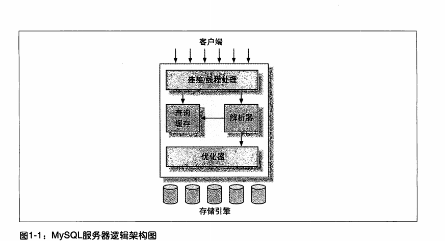

1. MYSQL 架构与历史
  ***
  1.1 MYSQL服务器逻辑架构图
        客户端  
        链接/线程处理  
        查询缓存 <- 解析器
            优化器   
        存储引擎  
          
        1.1.1 链接管理与安全性    
        * mysql5.5 支持服务器段，线程池插件，少量线程服务大量的链接    
        1.1.2 优化与执行  
        mysql解析查询，并创建内部数据结构（解析树），然后优化，包括
        重写查询，决定表的读取顺序，选择合适的索引。用户通过特殊的关键字来
        （hit）优化器。 优化解释器（expain）  
        影响因素 1，存储引擎（优化器不关心） 2，查询缓存
   ***
   1.2 并发控制
       多查询同一时刻修改数据，会产生并发控制。  
       讨论层面:1，服务器层  2.存储引擎层  
       1.2.1 读写锁  
       * 读锁:共享，不阻塞，多个用户同时读，不干扰  
       * 写锁:排他锁。写锁会阻塞其他的写锁和读锁  
       1.2.2 锁粒度  
       * mysql存储引擎实现自己的锁策略和锁粒度，锁有开销与数据安全达成平衡    
       * 表锁   
         开销小，适合大量的读操作。写锁操作会比读锁优先级更高。  
       * 行级锁  
         对并发处理友好。锁开销大。 Innodb XtraDB 支持     
         是存储引擎底层实现的，服务层没有实现  
   ***
   1.3 事务  
        * 特点：零和思维，一组操作是一个原子操作  
        * ACID 测试  
        * 原子性（atomicity）  
          事务不可在被分割。  
         * 一致性 (consistency)  
           数据库总是从一个一致性状态转换到另外一个一致性状态  
         * 隔离性（isolation）  
            通常来说，在一个事务在没有完全提交之前，对其他事务是不可见的。（隔离级别）  
         * 持久性（durability）  
            一旦事务提交，则其所作的修改，会永久保存在数据库中。   
        1.3.1 隔离级别  
            * READ UNCOMMIT (未提交读)  
                脏读  
            * READ COMMIT (提交读)  
                不可重复读  
            * REPEATABLE READ （可重复读）  
                MYSQL默认 解决脏读，会有幻行的问题。（存储引擎通过多版本并发控制，MVCC）  
            * SEARIALIZABLE 可串性化  
                最高级别，通过事务穿行执行，会在读取的每行都加锁。/  
              
         1.3.2 死锁  
         1.3.3 事务日志  
            启动事务日志，*修改行为*记录持久化到硬盘的事务日志中，预写式日志（Write-AheadLogging）,需写两次到磁盘  
         1.3.4 MYSQL 中的事务  
            两种事务引擎：InnoDB,NDB Cluster。第三方的 XtraDB 和 PBXT  
            自动提交（AutoCommit）  
            注意点:有些命令，执行之前，强制执行COMMIT操作，在数据定义语言DDL中，如ALTTER TABLE，LOCK TABLE
            通过设置 set transation isolation level 来设置隔离级别  
            * 在事务中混合使用存储引擎 不建议  
            1.隐式和显示锁定  
            隐式锁: Innodb 采用两阶段锁定协议，在事务执行过程中，随时可以执行锁定，只有在commit和rollbak
            时才会 释放。所有的锁同一时刻释放。    
            2.显示锁: 特定的语句显示锁定，  
            select .... LOCK IN SHARE MODE  不建议  
            select ... FOR UPDATE   不建议  
   ***
   1.4 多版本并发控制（MVCC)     
        * 定义: 通过数据在某个点的快照来实现的。  
        * 关注点: 提升性能，尽量避免加锁操作  
        * 实现方式:  乐观锁 悲观锁  
        * 结论： MVCC 在 可重复读 和 提交读 下可正常工作。  
   *** 
   1.5 MYSQL的存储引擎  
       定义: 存储底层是文件系统，每个schema 都保存在数据目录下的子目录下，每个表的创建会生成和表桶名的.frm 文件，来保存表的定义。  
       TIPS: SHOW TABLE STATUS LIKE "user" \G      
       1.5.1 InnoDB 存储引擎  
       关注点: 聚簇索引，存储格式独立  
       内部优化点: 1,可预测性预读 2，在内存中创建hash索引，加速读操作的自适应哈希索引（adaptive hash index），加速插入的加速缓冲区  
       1.5.2 MyISAM 存储引擎  
       缺点： 不支持事务 和行级锁，崩溃后无法安全恢复。  
       特性： 加锁和并发  修复  索引特性  延迟更新索引键    
       1.5.3 其他的引擎：  
       Archive 引擎  
       Blackhole 引擎  
       CSV 引擎  
       Federated 引擎  
       Memory 引擎  
       Merge 引擎  
       NDB 集群引擎  
       1.5.4 第三方存储引擎  
       xxx  
       面向列的存储引擎  