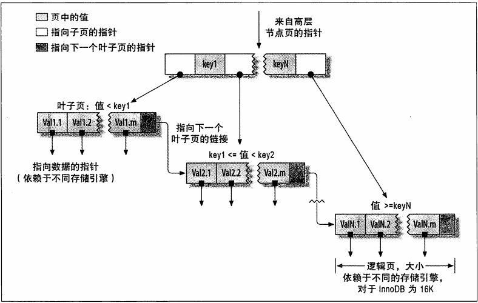
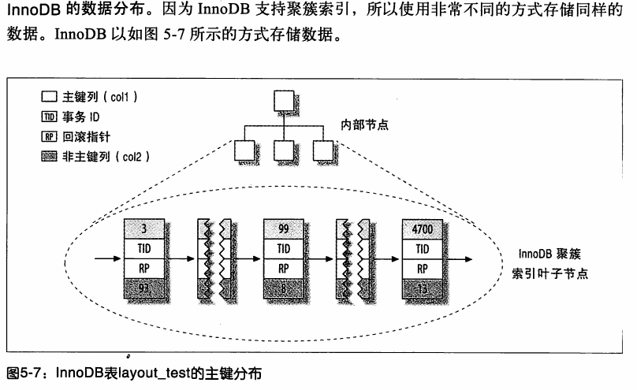

### 创建高性能的索引

***
5.1 索引基础
    特点： 只能高效的使用所有的最左前缀列
    5.1.1 索引的类型
    索引是在存储引擎层实现的，而不是服务器层实现的。
    * B-Tree 索引，  
    很多存储引擎使用的是 B+Tree,每一个叶子节点都包含指向下一个叶子节点的指针，
    从而方便叶子节点的范围遍历。  
    
    * 哈希索引(hash index)
       只存在memory 引擎    
    * 空间数据索引（R-Tree）  
    * 全文索引  
    * 分行树索引  
    * 聚簇索引  
    * 覆盖索引  
***
5.2 索引的优点  
    * 评价索引的好坏（三星系统）  
    1. 索引极大减少了服务器需要扫描的数据量  
    2. 索引可以帮助服务器避免排序和临时表
    3. 索引可以将随机I/O变成顺序I/O
***
5.3 高性能的索引策略   
    5.3.1 独立的列  
    5.3.2 前缀索引和索引选择  
    索引选择性： 不重复的索引值和数据表的记录总数的比值 
    * 当用字符串当索引时，会使用前缀索引来代替列索引  
    参考：通过计算完整列的选择性 和 前缀列的选择 两个做比较  
    5.3.3 多列索引  
    * 注意点： 不再在每个列都建一个索引，需要优化的点在 优化索引列的顺序，或创建一个全覆盖索引。  
    * 索引合并。  
    * 查询会对两个单列索引扫描合并。有三个算法变种。OR条件的联合，AND条件的相交，组合前两种情况的联合和相交  
    5.3.5 聚簇索引  
    * 聚簇索引事一种数据存储方式，InnoDB的聚簇索引是在同一个结构中保存了B-Tree索引和数据行
    聚簇：数据行存储在索引的叶子页上（leaf page） 表示数据行和相邻的键值紧凑的存储在一起。
    * 叶子页包含了行的全部数据，节点页包含了索引列。
    * mysql是用过主键来作为聚簇索引
    
    Innodb的二级索引的叶子节点，存储的不是”行指针“，而是主键值，以此作为指向行的指针。
    优点：减少行移动或者数据页分裂时，二级索引的维护工作。 Innodb再移动行时无须更新二级索引的这个指针。
    缺点：使用主键当行指针会让二级索引占用更多的空间。
    5.3.6 覆盖索引
    * 如果一个索引包含了所有需要查询的字段的值，就叫覆盖索引
    5.3.7 使用索引扫描做排序
    mysql 有两种方式生成有序的结果。1通过排序操作，2 按照索引顺序扫描
    只有当索引的列顺序和order by字句的顺序完全一致，并且所有列的排序方向（倒序或正序）都一样时，
    Mysql 才能使用索引来对结果做排序。如果查询需要关联多张表，则只有当
    Order by 字句引用的字段全部为第一个表时，才能使用索引做排序。
    order by 字句和查找型查询的限制是一样的，都需要满足索引的最左前缀的要求。
    否则，MYSQL 都需要执行排序操作，而无法利用索引排序。
    5.3.8 压缩（前缀压缩）索引  
    5.3.9 冗余和重复索引
    可以在相同的列创建不同的索引，常见的key key（col） 和 fulltext（）
    清楚冗余的索引
    写复杂的访问information_schema 中的一些视图来定位
    common_schema 是一系列可以安装到服务器上的常用的存储和视图
    还有percona toolkit 的 pt-duplicate-key-checker
    该工具通过分析表结构来找出冗余和重复的索引
    5.3.10 未使用的索引
    通过工具帮助定位，在percona server 或者 mariadb 中打开 userstate 服务器变量，让服务器运行一段时间，
    再通过information_schema.index_statistics 就能统计每个索引使用的频率。  
    还可以使用 percona tookit 的pt-index-usage
    5.3.11 索引和锁  
***
5.4 索引案例学习  
5.4.1 支持多种过滤条件
5.4.2 避免多个范围条件  
5.4.3 优化排序
    延迟关联 是一个好的思路 
5.5 维护索引和表  
5.5.1 找到并修复损坏的表  
通过check table 来检查表是否发生损坏。
5.5.5.2 更新索引统计信息  
 行碎片
 行间碎片
 剩余空间碎片
    
    
***
mysql的join操作，是在内存进行的吗